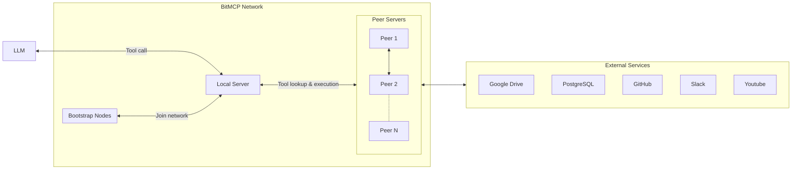

# bitmcp
A high-level protocol and library for building a peer-to-peer MCP network; inspired by BitTorrent.

## High-level Design

```mermaid
---

config:

  layout: dagre

  theme: neo

  look: neo

---

flowchart LR

 subgraph servers["Peer Servers"]

        D["Peer 1"]

        H["Peer 2"]

        E["Peer N"]

  end

 subgraph bootstrap["Bootstrap Nodes"]

  end

 subgraph network["BitMCP Network"]

        G["Local Server"]

        servers

        bootstrap

  end

 subgraph s1["External Services"]

        n1["Google Drive"]

        n2["PostgreSQL"]

        n3["GitHub"]

        n4["Slack"]

        n5["Youtube"]

  end

    A["LLM"] <---->|Tool call| G

    G <--->|Tool lookup & execution| servers

    D <--> H

    H -.- E

    bootstrap <--->|Join network| G

    servers <---> s1

    A@{ shape: rect}
```