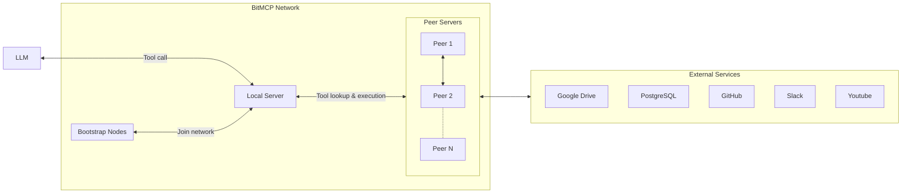

# bitmcp
A high-level protocol and library for building a peer-to-peer MCP network; inspired by BitTorrent.

## Overview

This project envisions a decentralized peer-to-peer (P2P) network of MCP servers, inspired by BitTorrent’s DHT-based model. Instead of a centralized directory, each MCP server peer advertises its tools on a Distributed Hash Table (DHT). This allows any MCP client to discover and invoke tools across the network without a central broker. 

The design prioritizes privacy (no central aggregator of usage data), fault tolerance (no single point of failure), and extensibility (anyone can join with new tools)

## Design

## How it works

- Each MCP server (peer) joins a DHT network. It advertises the tools it offers by storing metadata in the DHT.
- When a client wants to see all available tools, the local server performs a DHT traversal to aggregate tool metadata from all peers (effectively "crawling" the DHT for keys representing tools).
- When a client needs a specific tool, the local server uses a DHT lookup to find which peer provides that tool. 
- After discovery, the actual tool invocation runs peer-to-peer (e.g. via an MCP request or RPC).
- The network is designed to handle churn (peers joining/leaving) gracefully, using DHT replication and periodic refresh so that tool listings remain available.